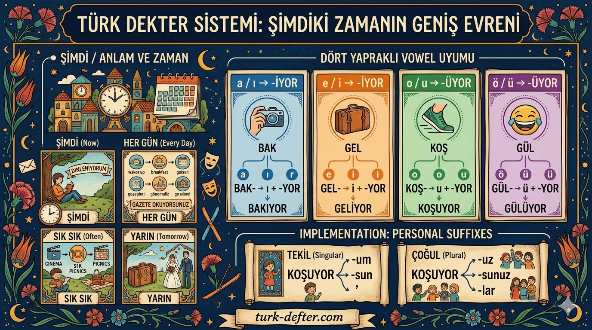

In Turkish, the present continuous tense (**-iyor**) is the workhorse of the language. While we use it for what is happening "right now," it also handles habits and firm future plans. Think of it as the default "active" state.

## The Vowel Harmony Logic

The suffix `-yor` is fixed, but the "buffer" vowel preceding it must satisfy 4-way vowel harmony

| **Last Vowel in Stem** | **Suffix to Add** | **Example**                   |
| ---------------------- | ----------------- | ----------------------------- |
| **a, ı**               | **-ıyor**         | **bak** (look) → bak**ıyor**  |
| **e, i**               | **-iyor**         | **gel** (come) → gel**iyor**  |
| **o, u**               | **-uyor**         | **koş** (run) → koş**uyor**   |
| **ö, ü**               | **-üyor**         | **gül** (laugh) → gül**üyor** |

## Implementation: 22 Sentences

Here is a breakdown of the present continuous in action, ranging from immediate actions to habitual routines and future intent.

| **#** | **Turkish Sentence**                                     | **English Translation**                               |
| ----- | -------------------------------------------------------- | ----------------------------------------------------- |
| 1     | Ben **şimdi** dinlen**iyorum**.                          | I am resting **now**.                                 |
| 2     | Sen **şimdi** gazete oku**yorsun**.                      | You are reading a newspaper **now**.                  |
| 3     | O **şimdi** mektup yaz**ıyor**.                          | He/She is writing a letter **now**.                   |
| 4     | Biz **şimdi** ders çalış**ıyoruz**.                      | We are studying **now**.                              |
| 5     | Siz **şimdi** havuzda yüz**üyorsunuz**.                  | You (pl) are swimming in the pool **now**.            |
| 6     | Onlar **şimdi** tenis oyna**yorlar**.                    | They are playing tennis **now**.                      |
| 7     | Ben **her gün** televizyon seyred**iyorum**.             | I watch television **every day**.                     |
| 8     | Sen **her sabah** kahvaltıda çay iç**iyorsun**.          | You drink tea at breakfast **every morning**.         |
| 9     | O **her yıl** tatilde bu otelde kal**ıyor**.             | He/She stays at this hotel **every year** on holiday. |
| 10    | Biz **her ay** tiyatroya gid**iyoruz**.                  | We go to the theater **every month**.                 |
| 11    | Siz **her kış** kayak yap**ıyorsunuz**.                  | You (pl) ski **every winter**.                        |
| 12    | Onlar **her sabah** spor yap**ıyorlar**.                 | They do sports **every morning**.                     |
| 13    | Ben **genellikle** **her sabah** kahve iç**iyorum**.     | I **usually** drink coffee **every morning**.         |
| 14    | Sen **sık sık** sinemaya gid**iyorsun**.                 | You go to the cinema **often**.                       |
| 15    | O **sık sık** yalan söyl**üyor**.                        | He/She **often** tells lies.                          |
| 16    | Biz **genellikle** hafta sonunda evde kal**ıyoruz**.     | We **usually** stay at home at the weekend.           |
| 17    | Siz **sık sık** bu lokantada öğle yemeği ye**yorsunuz**. | You (pl) **often** eat lunch in this restaurant.      |
| 18    | Onlar **genellikle** burada piknik yap**ıyorlar**.       | They **usually** have a picnic here.                  |
| 19    | Ben **yarın** tatile çık**ıyorum**.                      | I am going on holiday **tomorrow**.                   |
| 20    | O **gelecek ay** evlen**iyor**.                          | He/She is getting married **next month**.             |
| 21    | Biz **yarın** gel**iyoruz**.                             | We are coming **tomorrow**.                           |
| 22    | Siz **her gün** gazete oku**yorsunuz**.                  | You (pl) read the newspaper **every day**.            |  |  |  |

## Debugging the Edge Cases

When building these sentences, keep an eye on these three common "runtime errors":

- **Vowel Narrowing:** If a verb ends in `-a` or `-e` (like _oyna-_ or _söyle-_), that vowel drops or changes before adding `-iyor`.
- **Consonant Mutation:** For specific verbs like _git-_ (to go) and _et-_ (to do), the `t` softens to a `d` when the vowel suffix hits it (_gidiyor_, _ediyor_).  
- **The "Ye" Exception:** The verb _ye-_ (to eat) narrows its vowel to an `i`, becoming **yiyor**.

## Trigger Phrases

The following keywords are strong indicators that you should be using the `-iyor` suffix:

| **Turkish**     | **English**         | **Example from Worksheet**             |
| --------------- | ------------------- | -------------------------------------- |
| **Şimdi**       | Now                 | _Ben **şimdi** dinleniyorum._          |
| **Şu an**       | At the moment       | (Not in list, but very common)         |
| **Her gün**     | Every day           | _Siz **her gün** gazete okuyorsunuz._  |
| **Her sabah**   | Every morning       | _Onlar **her sabah** spor yapıyorlar._ |
| **Her ay**      | Every month         | _Biz **her ay** tiyatroya gidiyoruz._  |
| **Genellikle**  | Generally / Usually | _Biz **genellikle** evde kalıyoruz._   |
| **Sık sık**     | Often               | _Sen **sık sık** sinemaya gidiyorsun._ |
| **Yarın**       | Tomorrow            | _Ben **yarın** tatile çıkıyorum._      |
| **Gelecek ay**  | Next month          | _O **gelecek ay** evleniyor._          |
| **Gelecek yıl** | Next year           | (Used for distant but certain plans)   |
