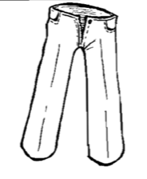
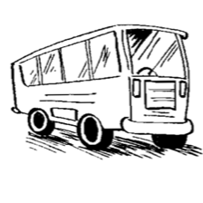
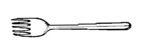
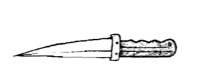
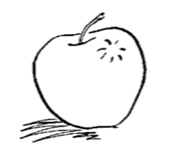
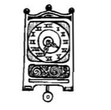
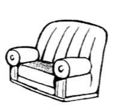
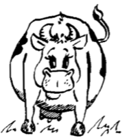

| Image                      | Question | Answer      |
| -------------------------- | -------- | ----------- |
|  | Bu ne?   | Bu pantolon |
|      | Bu ne?   | Bu otobüs   |
|    | O ne?    | O çatal     |
|  | Şu ne?   | Şu biçak    |
|  | Bu ne?   | Bu elma     |
|  | Bu ne?   | Bu saat     |
|  | O ne?    | O kanepe    |
|      | Şu ne?   | Şu inek     |

## Alfabe Exercize

| Word     | Plural      | Translation      |
| -------- | ----------- | ---------------- |
| Araba    | Arabalar    | Car              |
| Bisiklet | Bisikleter  | Bicycle          |
| Camii    | Camiler     | Mosque           |
| Çiçek    | Çiçekler    | flower           |
| Demlik   | Demliker    | Teapot           |
| Elma     | Elmalar     | Apple            |
| Firça    | Firçasar    | Brush            |
| Gemi     | Gemiler     | Boat             |
| Ğ        | N/A         | N/A              |
| Halı     | halıler     | carpet           |
| Işik     | ișiklar     | lights           |
| İşçi     | işçiler     | worker           |
| Jilet    | jiletler    | razor            |
| Keman    | kemanlar    | violin           |
| Limon    | limonlar    | lemon            |
| Merdiven | merdivenler | stairs           |
| Nargile  | nargileler  | hookah / sheesha |
| Otobüs   | otobüsler   | bus              |
| Peynir   | peynirler   | cheese           |
| Radyo    | radyolar    | radio            |
| Üzüm     | üzümler     | grape            |
| Valiz    | valizler    | suitcase         |
| Yastık   | yastıklar   | pillow           |
| Zürafa   | zürafalar   | giraffe          |
